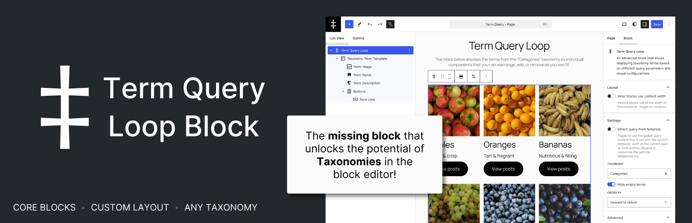

# Term Query Loop Block Plugin

An advanced block that allows displaying taxonomy terms based on different query parameters and visual configurations, similar to the Query Loop block.

This is an attempt to fill a gap in WordPress core, see https://github.com/WordPress/gutenberg/issues/49094

Please note that this is still a work-in-progress. The plugin is not yet ready for production use. If you'd like to test it, [download the latest prerelease here](https://github.com/cr0ybot/term-query/releases/latest).

This plugin supports [Git Updater](https://github.com/afragen/git-updater) for updating the plugin while in development. Branch switching is not currently supported, since there are assets that need to be built for each release.

## Blocks

### Taxonomy Terms: `cr0ybot/term-query`

The Taxonomy Terms block is the main block that is used to display taxonomy terms from a term query. It is similar to the Query Loop block, but instead of querying posts from the WordPress database, it queries terms and provides [block context](https://developer.wordpress.org/block-editor/reference-guides/block-api/block-context/) values for [block bindings](#block-bindings).

### Term Template: `cr0ybot/term-template`

The Term Template block is used to display the layout of a single term. It is similar to the Post Template block, but instead of displaying a post, it displays term information.

Inside the Term Template block, you can add [certain blocks](#block-variations) that display information about the term via block context. These blocks are simply variations of core blocks that this plugin provides to add the block bindings. You can add any other block inside the Term Template block as well, like groups and columns, to lay out the parts as you see fit.

## Block Variations

- **Term Title**: Heading block that displays the term title.
- **Term Description**: Paragraph block that displays the term description.
- **Term Count**: Paragraph block that displays the term count.
- **Term Link**: Button block that links to the term archive.

## Block Bindings

[Block bindings](https://developer.wordpress.org/block-editor/reference-guides/block-api/block-bindings/) let you insert dynamic data into certain existing blocks. This plugin provides the following bindings with arguments:

### Term: `term-query/term`

| Argument | Possible Values | Description |
| --- | --- | --- |
| `key` | `id`, `slug`, `name`, `description`, `count`, `link`, `parent`, `slug`, `taxonomy` | The key of the term data to display. These generally correspond to the properties returned by the taxonomy REST API endpoint. |

### Term Meta: `term-query/term-meta`

| Argument | Possible Values | Description |
| --- | --- | --- |
| `key` | Any meta key | The key of the term meta to display. |
| `transform` | `attachment_id_to_url`, `attachment_id_to_image_alt`, custom transform key | A transformation to apply to the meta value. Built-in transformations are detailed below. |

### Transformations

Term meta values often contain values that must be transformed into something else to be useable, such as an attachment ID into a URL.

The following transformations are available in the plugin:

- **attachment_id_to_url**: Transforms an attachment ID into the URL of the attachment.
- **attachment_id_to_image_alt**: Transforms an attachment ID into the alt text of the attachment.

To create a custom transform, you can use the `term_query_term_meta_transform_{$transform_key}` filter in PHP for the front end and the `termQuery.termMetaTransform.{$transformKey}` filter in JavaScript for the editor. See [includes/transforms.php](/includes/transforms.php) and [src/editor/transforms.js](/src/editor/transforms.js) to reference how the built-in transforms are implemented.

## Extending the Term Query Loop Block

Though the Term Query Loop Block is quite versatile on its own, you can extend it further to present bespoke versions of the block with their own presets and additional or removed settings.

Where possible, this plugin has been designed to follow the same extensibility patterns as the core Query Loop block, [described here](https://developer.wordpress.org/block-editor/how-to-guides/block-tutorial/extending-the-query-loop-block/). There are some subtle differences that are detailed below.

### Extending with block variations

The process for registering block variations is very similar to the core Query block,[described here](https://developer.wordpress.org/block-editor/how-to-guides/block-tutorial/extending-the-query-loop-block/#extending-the-block-with-variations). The primary differences are that the block to register the variations on is `cr0ybot/term-query`, all attributes will be used except for the `taxonomy`,`parent`, and `inherit` query properties when used via `scope: [ 'block' ]`, and when creating block patterns to associate with a custom variation you should add the name of your variation prefixed with the Term Query Loop block name (e.g. `cr0ybot/term-query/$variation_name`) to the pattern's `blockTypes` property.

### Disabling controls

The process for disabling irrelevant or unsupported controls is similar to the core Query Loop block, using the variation's `allowedControls` property as [described here](https://developer.wordpress.org/block-editor/how-to-guides/block-tutorial/extending-the-query-loop-block/#extending-the-query). The following controls are available for this block:

- `inherit` - Shows the toggle switch for allowing the query to be inherited directly from the template. Hidden automatically if the block is nested.
- `taxonomy` - Shows a dropdown of available taxonomies.
- `parent` - Shows a dropdown of available parent terms. Hidden automatically if the block is nested.
- `order` - Shows a dropdown of available order options. Hidden automatically if the block is nested.
- `hideEmpty` - Shows a toggle switch for hiding empty terms.
- `perPage` - Shows a number control for setting the number of terms per page.
- `stickyTerms` - Shows a search field for adding specific terms to the top of the list.

### Allowlisting taxonomies

Unique to this block, the `allowedTaxonomies` property can be used to limit the taxonomies that can be selected in the block's taxonomy control. This is done by adding the taxonomy slugs to the array. If the property is not set, all taxonomies will be available. Setting the property to an empty array is not advised, as it will prevent any taxonomies from being selected.

### Adding additional controls

Controls may be added the same way as the core Query Loop block, [described here](https://developer.wordpress.org/block-editor/how-to-guides/block-tutorial/extending-the-query-loop-block/#adding-additional-controls).

### Altering the query on the front end

The [term_query_loop_block_query_vars](#filter-term_query_loop_block_query_vars) filter is available to alter the query arguments before they are passed to the `WP_Term_Query` contructor. You can add the filter within a `pre_render_block` filter that checks for the Term Query Loop block's `namespace` attributes as [described here](https://developer.wordpress.org/block-editor/how-to-guides/block-tutorial/extending-the-query-loop-block/#making-your-custom-query-work-on-the-front-end-side) to determine whether the filter should be added, as the query vars filter happens within the nested Term Template block (which does not have a namespace attribute).

### Altering the preview query in the editor

Filtering the query that happens in the editor must be done by filtering the REST response as [described here](https://developer.wordpress.org/block-editor/how-to-guides/block-tutorial/extending-the-query-loop-block/#making-your-custom-query-work-on-the-editor-side), except that you must use the `rest_{$this->taxonomy}_query` filter instead of the `rest_{$this->postType}_query` filter.

## Filters

### Filter `term_query_loop_block_query_vars`

Filters the `WP_Term_Query` arguments for the block rendered on the front end. This can be compared to the `query_loop_block_query_vars` filter in the Query Loop block.

```php
apply_filters( 'term_query_loop_block_query_vars', array $query_vars, WP_Block $block, int $page );
```

#### Parameters

- `$query_vars` (array): Array containing arguments for `WP_Term_Query` as parsed by the block context.
- `$block` (WP_Block): The block instance.
- `$page` (int): The current query's page.

#### Example

```php
add_filter( 'pre_render_block', 'my_apply_term_query_loop_block_filters', 10, 2 );

function my_apply_term_query_loop_block_filters( $pre_render, $parsed_block ) {
	if ( 'my-plugin/my-term-query' !== $parsed_block['attrs']['namespace'] ) {
		return $pre_render;
	}

	add_filter( 'term_query_loop_block_query_vars', 'my_term_query_loop_block_query_vars', 10, 3 );

	return $pre_render;
}

add_filter( 'term_query_loop_block_query_vars', 'my_term_query_loop_block_query_vars', 10, 3 );

function my_term_query_loop_block_query_vars( $query_vars, $block, $page ) {
	// Alter the $query_vars here.
	$query_vars['orderby'] = 'name';

	return $query_vars;
}
```
