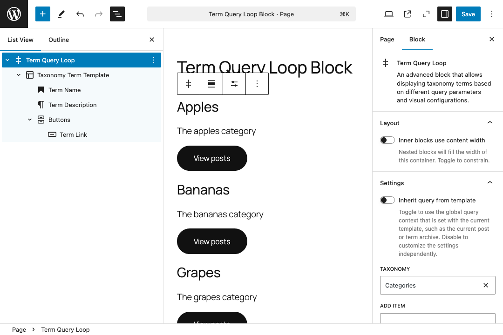

# Term Query Block Plugin

An advanced block that allows displaying taxonomy terms based on different query parameters and visual configurations, similar to the Query Loop block.

This is an attempt to fill a gap in WordPress core, see https://github.com/WordPress/gutenberg/issues/49094

Please note that this is still a work-in-progress. The plugin is not yet ready for production use.

## Blocks

### Taxonomy Terms: `cr0ybot/term-query`

The Taxonomy Terms block is the main block that is used to display taxonomy terms from a term query. It is similar to the Query Loop block, but instead of querying posts from the WordPress database, it queries terms and provides [block context](https://developer.wordpress.org/block-editor/reference-guides/block-api/block-context/) values for [block bindings](#block-bindings).

### Term Template: `cr0ybot/term-template`

The Term Template block is used to display the layout of a single term. It is similar to the Post Template block, but instead of displaying a post, it displays term information.

Inside the Term Template block, you can add [certain blocks](#block-variations) that display information about the term via block context. These blocks are simply variations of core blocks that this plugin provides to add the block bindings. You can add any other block inside the Term Template block as well, like groups and columns, to lay out the parts as you see fit.

## Block Variations

- **Term Title**: Heading block that displays the term title.
- **Term Description**: Paragraph block that displays the term description.
- **Term Count**: Paragraph block that displays the term count.
- **Term Link**: Button block that links to the term archive.

## Block Bindings

[Block bindings](https://developer.wordpress.org/block-editor/reference-guides/block-api/block-bindings/) let you insert dynamic data into certain existing blocks. This plugin provides the following bindings with arguments:

### Term: `term-query/term`

| Argument | Possible Values | Description |
| --- | --- | --- |
| `key` | `id`, `slug`, `name`, `description`, `count`, `link`, `parent`, `slug`, `taxonomy` | The key of the term data to display. These generally correspond to the properties returned by the taxonomy REST API endpoint. |

## Term Meta: `term-query/term-meta`

| Argument | Possible Values | Description |
| --- | --- | --- |
| `key` | Any meta key | The key of the term meta to display. |
| `transform` | `attachmentURL`, `attachmentImageAlt` | A transformation to apply to the meta value. Transformations are detailed below. |

### Transformations

Term meta values often contain just an ID that needs to be transformed into a useable value. The following transformations are available:

- **attachmentURL**: Transforms an attachment ID into the URL of the attachment.
- **attachmentImageAlt**: Transforms an attachment ID into the alt text of the attachment.
